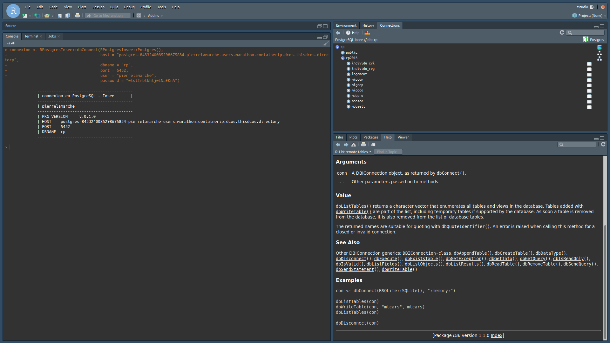

```{r setup, include=FALSE}
library(knitr)
library(learnr)
knitr::opts_chunk$set(echo = TRUE)
```

## Objectif du tutoriel

Ce tutoriel illustre la connexion depuis `R` à une instance Postgres qui contient les données du Recensement de Population 2016, disponibles sur le [site de l'Insee](https://www.insee.fr/fr/statistiques/4171558). L'instance en question a été déployée sur la plateforme Onyxia du SSPCloud, et n'est accessible que depuis cette plateforme.

On montera quelques usages que l'on peut faire à partir de cette instance et en quoi combiner `R` et Postgres est utile.

## Pourquoi utiliser une base de données

Les données du Recensement de Population sont assez volumineuses ; pour les données de 2016, elles représentent environ 63 Go. Il est par conséquent illusoire de vouloir travailler avec l'ensemble de ces données chargées simultanément en mémoire avec `R`. La seule table `logement` contient 25 millions de lignes et peut déjà représenter une difficulté pour certaines machines. Ces contraintes d'espace tombent avec un système de base de données. 

## Comment utiliser une base de données avec `R`

### Se connecter à la base Postgres

Comme indiqué dans la [documentation UtilitR](https://linogaliana.gitlab.io/documentationR/se-connecter-%C3%A0-une-base-de-donn%C3%A9es.html#se-connecter-%C3%A0-une-base-de-donn%C3%A9es-1), il est possible d'utiliser différents *packages* pour se connecter à la base de données. Quelle que soit la solution utilisée, il faut disposer de cinq paramètres pour générer la connexion à la base de données :

* l'URL de la base de données, que l'on peut décrire comme l'adresse du serveur contenant la base de données ;
* le port de la base de données, une sorte de complément à l'adresse ;
* le nom de la base de données ;
* l'identifiant de connexion (souvent l'Idep, mais parfois autre chose), soit l'identité de la personne qui se connecte ;
* le mot de passe associé à l'identifiant.

Dans l'exemple qui nous intéresse, l'URL de la base de données est la suivante : 
```{r, echo = FALSE}
Sys.getenv("PGRP_HOST")
```
Le nom de la base de données est `rp`, le port `5432`. On se connecte avec un identifiant générique d'utilisateur, `user_read`. Cet identifiant a été créé pour permettre à tous ceux qui souhaitent se connecter à la base de données de le faire, sans toutefois leur permettre de modifier la base en question ; c'est pour cette raison qu'on parle *d'accès en lecture*. Le mot de passe, lui aussi partagé, est le suivant : `RP2016Insee`.

On va donc créer un objet `connexion` pour se connecter à la base de données, en utilisant les informations décrites ci-dessus, et en utilisant la fonction `dbConnect` du *package* `RPostgres`. C'est au travers de cet objet `connexion` qu'on va passer pour toutes les requêtes que l'on souhaite soumettre à la base de données. En utilisant le _package_ `RPostgres`, la connexion se fait de la manière suivante :

```{r connexion, exercise = TRUE}
### création d'un objet connexion
library(DBI)
connexion <- dbConnect(RPostgres::Postgres(),
                       host = "192.168.1.24",
                       dbname = "rp",
                       port = 5432,
                       user = "user_read",
                       password = "RP2016Insee")

### lister les tables du schéma rp2016
dbGetQuery(connexion, "select tablename from pg_catalog.pg_tables where schemaname = 'rp2016'")
```
Dans l'usage courant, il est fortement déconseillé d'inscrire "en dur" les identifiants de connexion tels que le mot de passe ou même l'identifiant. Utiliser des fonctions telles que `rstudio::askForPassword` permet un usage interactif du code, sans dévoiler des éléments confidentiels tels que les identifiants de connexion.

### Visualiser la base de données

Sous RStudio, il est possible de visualiser la structure de la base de données à laquelle on est connecté dans l'onglet `Connections` dans le panneau en haut à droite de l'écran.



